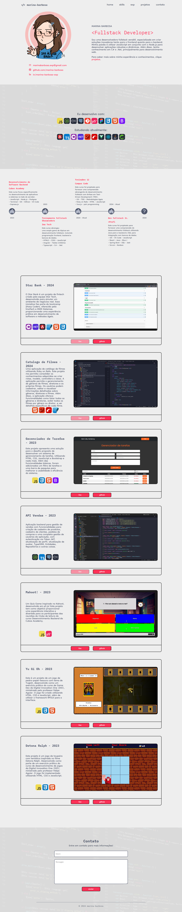

Deploy: https://marina-barbosa.github.io/portfolio-v3/

## Versão Antiga de Portfólio
Este repositório contém a versão anterior do meu portfólio pessoal. Ele foi desenvolvido para apresentar meus projetos, habilidades e experiências como desenvolvedora, com foco nas tecnologias que utilizei durante minha trajetória.

## Tecnologias Utilizadas
A versão antiga do portfólio foi desenvolvida utilizando as seguintes tecnologias:

- HTML5: Estruturação de conteúdo.
- CSS3: Estilização e layout responsivo.
- JavaScript: Funcionalidades interativas.
- ReactJS: Componentes dinâmicos e estrutura do front-end.
- Bootstrap: Layout rápido e responsivo (caso tenha sido utilizado).
- Font Awesome: Ícones escaláveis para melhorar a visualização.
- Devicons: Ícones para representar habilidades e ferramentas de desenvolvimento.
- SkillIcons: Ícones para destacar habilidades e tecnologias de programação.
- ScrollReveal.js: Animações ao rolar a página, trazendo interatividade visual.

 
 
 

